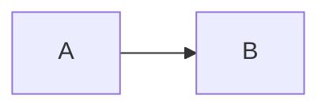

# Welcome

A link to [[Second note]] and a #topic tag.

> [!note] A callout
> With **bold** text.

$$
E = mc^2
$$


```mermaid
graph LR
  A --> B
```

Read [page 3 of the paper](papers/five.pdf#page=3).

```query
zebra
```
